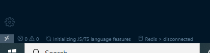

#  Redis Command Runner

This extension allows connecting to a redis server and running commands against the server and displaying the results

## Features

### Redis Comand Runner: Connect

Connects to a Redis server. The first time you connect to a server using this extension an input is displayed to enter the url of the server, then a prompt is displayed to allow a password to be entered, (if a password is not required you can just press the enter key). After you have connected to a server the addessess will be displayed in a quick pick when using the connect command in the future, this quickpick list currently holds 5 different server urls. The current connection status and server address is displayed in the bottom right hand of the editor window.

### Redis Command Runner: Command

Sends a command to the Redis server and displays the server's output. A prompt is displayed to enter the command, the whole command is entered into the prompt. Text for a command parameter that includes spaces needs to be enclosed in single or double quotes. the command input field also displays the last 10 quique commands sent to a redis server.

### Redis Command Runner: Disconnect

Disconnects from the redis server.

## Requirements

Currently the extension does not hve any requirements or dependencies.

## Extension Settings

This extension provides some settings under the title 'Redis Command Runner' in the 'settings.json' file.

server-urls: a string array listing the server addesses to display in the quick pick list when using the connect command, maximum 5.

commands: a string array listing previous commands that have been sent to a redis server successfully, maximum 10.

## Known Issues and Feature Requests

Issues and feature request can be report via [Github](https://github.com/zerosandones/redis-command-runner/issues).

## Release Notes

The change log for the extension can be found [here](https://github.com/zerosandones/redis-command-runner/blob/master/CHANGELOG.md)

## License

MIT
